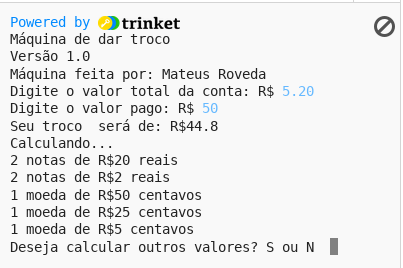

# PyMTroco
Máquina de troco feita em python para estudos.
Caso queira ver ela funcionando, basta acessar esse link [https://trinket.io/python/97ddd77708](https://trinket.io/python/97ddd77708)

## Funcionamento
Esse script basicamente solicita qual o valor da conta que você tem para pagar, após digitar o valor ele irá pedir quanto você pagou pela conta. Após inserir o valor pago, o script calcula quanto você precisa receber de troco e diz quantas notas/moedas de cada valor você receberá (isso não está otimizado, ele sempre pega o maior número possível de notas maiores).

## Screenshot

## Autor
Mateus Roveda

## Contribuição
Sinta-se a vontade para utilizar esse script em seus projetos ou até mesmo em melhora-lo.

## Licença
Visitar o arquivo [LICENSE](LICENSE)
